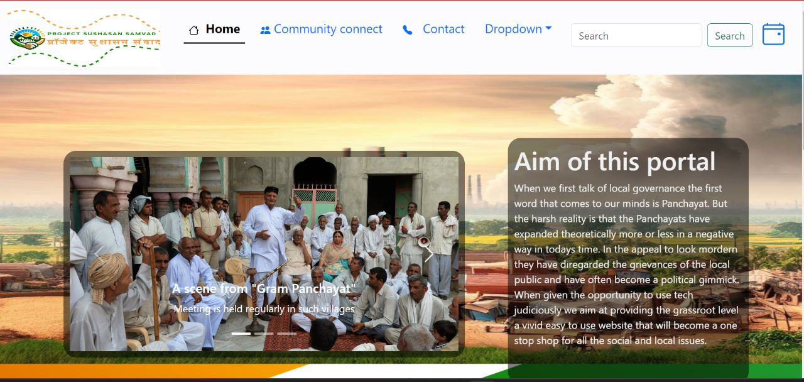

# Sushasan Samvad

## Technologies Used
 - Python (with the Django framework)
 - HTML
 - CSS
 - JavaScript
 - SQLite

## Introduction
When we first talk of local governance the first word that comes to our minds is Panchayat.
But the harsh reality is that the Panchayats have expanded theoretically more or less in a
negative way in today's time. In the appeal to look mordern they have diregarded the
grievances of the local public and have often become a political gimmick. When given the
opportunity to use tech judiciously we aim at providing the grassroot level a vivid easy to
use website that will become a one stop shop for all the social and local issues.

## Project Sushasan Samvad
The name is a true essance and totally represents the aim of our
website which is to facilitate sushasan and samvaad. The logo
depicts interconnected hands, symbolizing communication— a
cornerstone of our website. The varying hut sizes illustrate
bridging administrative gaps for transparency. The sun heralds a
new digital era in local governance.

### Insight
Our project Sushasan Samvad proposes to solve
the problem of local governance by enhancing
the Panchayati Raj System digitally.
 - This web portal will allow recording of all the
Panchayat meets and uploading of them
online which will be visible to all irrespective
of the time periods.
 - These recorded meets will be accessible to
all the villagers as well as all the levels of
administration for transparency, supervision
and moderation.
 - Our site will have a meeting calander wherein
the villagers can drop in their reviews and
feedback for each meeting.
 - We will also provide a facility known as " "Shikayat Forum" wherein the
villagers will not have to wait for weeks to express their grievances but will be
able to list their concerns as agendas for the next meeting (since thes
concerns wouldn't be voiced out specifically in meetings there are high
chances that they are acknowledged and solved beforehand).
 - Important grievances and concerns that prevail will be listed as agendas.
When one clicks on the upcoming meeting date he will be redirected to an
agenda page that will be constituting all the grivances and concerns that are
yet to be solved and require discussion and deliberation.
 - We will also provide a facility known as "
"Shikayat Forum" wherein the villagers will not
have to wait for weeks to express their grievances
but will be able to list their concerns as agendas
for the next meeting (since thes concerns
wouldn't be voiced out specifically in meetings
there are high chances that they are
acknowledged and solved beforehand).
 - Important grievances and concerns that prevail
will be listed as agendas. When one clicks on the
upcoming meeting date he will be redirected to
an agenda page that will be constituting all the
grivances and concerns that are yet to be solved
and require discussion and deliberation.
 - The website will also have a concrete community
connect network which will attract NGO'S and
community service providers to bring about an
impact at the rural level through their services
and participation in strengthening education,
literacy and the economic growth. The NGO's will
also integrate with the website in providing the
villagers apt knowledge to use the website
